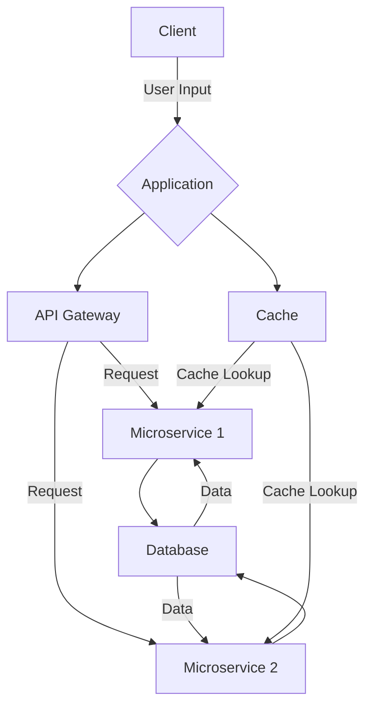

This diagram represents the CliffordNet system design, illustrating the flow of data between the various components, including the client, application, API gateway, microservices, and the database with cache integration.