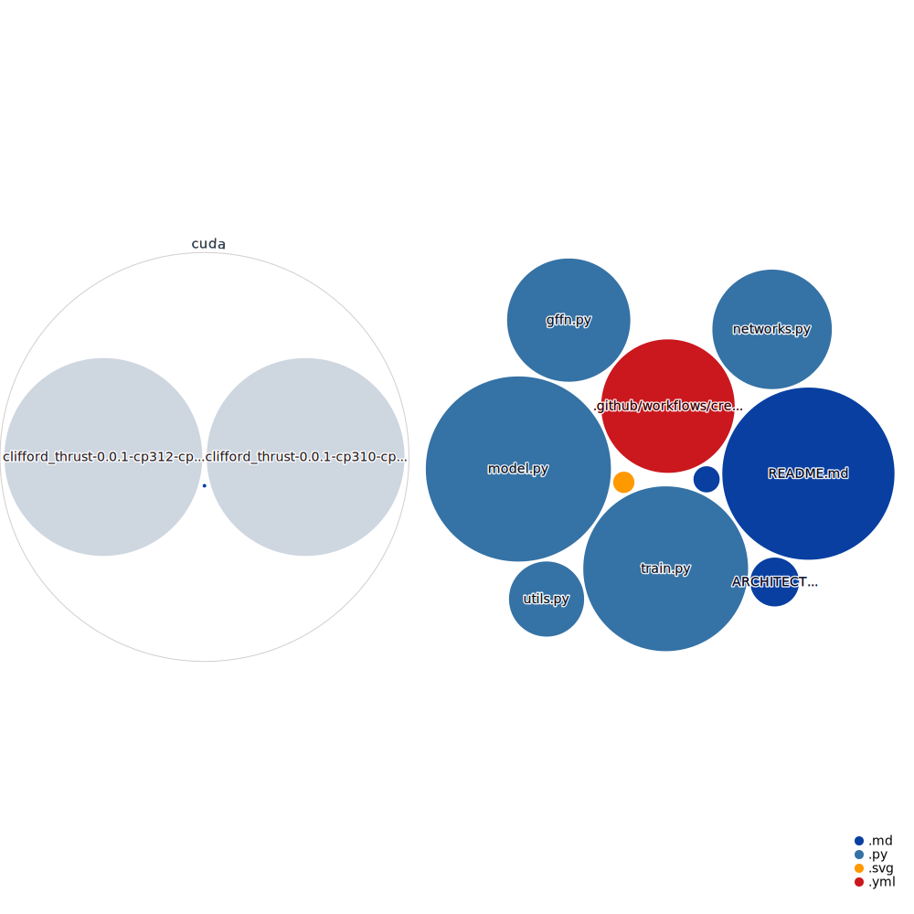

<div align="center">

# CliffordNet: All You Need is Geometric Algebra
## Repository Structure




[](https://opensource.org/licenses/MIT)
[](https://github.com)
[](https://pytorch.org/)
[](https://arxiv.org/abs/2601.06793)
[](https://triton-lang.org/)

“The two systems [Hamilton’s and Grassmann’s]
are not only consistent with one another, but they
are actually parts of a larger whole.”

— William Kingdon Clifford, 1878

</div>

Official implementation of the paper **"CliffordNet: All You Need is Geometric Algebra"**.

We introduce **Clifford Algebra Network (CAN)**, a novel vision backbone that challenges the necessity of Feed-Forward Networks (FFNs) in deep learning. By operationalizing the full **Clifford Geometric Product** ($uv = u \cdot v + u \wedge v$), we unify feature coherence and structural variation into a single, algebraically complete interaction layer.

Our **"No-FFN"** variant demonstrates that this geometric interaction is so expressive that heavy MLPs become redundant, establishing a new Pareto frontier for efficient visual representation learning.

## 🚀 News & Updates

*   **[2026-02-17]** 🔥 **Released the code for preliminary experiments on CIFAR-100.**
*   **[2026-01-20]** 🏆 **New SOTA:**
    *   **Nano (1.4M)** reaches **77.82%**, outperforming ResNet-18 (11M).
    *   **Lite (2.6M)** reaches **79.05%** without FFN, rivaling ResNet-50.
    *   **32-Layer Deep Model** achieves **81.42%** with only 4.8M parameters.
*   **[2026-01-12]** ⚡ **Performance Preview:** We have successfully implemented a custom **Fused Triton Kernel** for the Clifford Interaction layer. Preliminary benchmarks on RTX 4090 show a **10x kernel speedup** and **~2x end-to-end training speedup**. *Code coming soon!*
*   **[2026-01-01]** 🏆 **SOTA on CIFAR-100:** Our Nano model (1.4M) matches ResNet-18 (11M), and our No-FFN model outperforms MobileNetV2 by >6%.

## 🏆 Main Results (CIFAR-100)

We compare CliffordNet against established efficient backbones under a rigorous "Modern Training Recipe" (200 Epochs, AdamW, AutoAugment, DropPath).

### Efficiency & Performance
| Model Variant | Params | MLP Ratio | Context Mode | Top-1 Acc | vs. Baseline |
| :--- | :---: | :---: | :---: | :---: | :--- |
| **Baselines** | | | | | |
| MobileNetV2 | 2.3M | - | - | 70.90% | - |
| ShuffleNetV2 1.5x | 2.6M | - | - | 75.95% | - |
| ResNet-18 | 11.2M | - | - | 76.75% | - |
| ResNet-50 | 23.7M | - | - | 79.14% | - |
| **CliffordNet (Ours)** | | | | | |
| **CAN-Nano** | **1.4M** | **0.0** | Diff ($\Delta H$) | **77.82%** | <span style="color:green">> ResNet-18</span> |
| **CAN-Lite** | **2.6M** | **0.0** | Diff ($\Delta H$) | **79.05%** | <span style="color:green">~ ResNet-50</span> |
| **CAN-32 (Deep)**| 4.8M | 0.0 | Full | **81.42%** | <span style="color:green">**SOTA**</span> |
| **CAN-64 (Deep)**| 8.6M | 0.0 | Full | **82.46%** | <span style="color:green">**SOTA**</span> |

> **Key Insight:** Our **Nano** variant (1.4M) outperforms the heavy-weight **ResNet-18** (11.2M) by **+1.07%** while using **$8\times$ fewer parameters**. The **Lite** variant (No-FFN) effectively matches ResNet-50 with **$9\times$ fewer parameters**.

## 🏗️ Architecture & Theory

The evolution of features in CliffordNet is governed by a **Geometric Diffusion-Reaction Equation**. We introduce a unified superposition principle that integrates local differential context and global mean fields:

$$
\frac{\partial H}{\partial t} = \mathcal{P}_{loc}\Big( H (\mathcal{C}_{loc}) \Big) + \beta \cdot \mathcal{P}_{glo}\Big( H (\mathcal{C}_{glo}) \Big) 
$$

Where $\mathcal{C}_{loc} \approx \Delta H$ (Local Laplacian) and $\mathcal{C}_{glo} = \text{GlobalAvg}(H)$. The interaction term is expanded via the **Clifford Geometric Product**, unifying scalar and bivector components:

$$
\mathcal{P}\Big( H(\mathcal{C}) \Big) = \mathcal{P}\Big( \underbrace{\mathcal{D}(H, \mathcal{C})}_{\text{Scalar Component}} \oplus \underbrace{\mathcal{W}(H, \mathcal{C})}_{\text{Bivector Component}} \Big)
$$

## 🛠️ Usage

CliffordNet supports two execution modes: a **High-Performance Mode** (using custom CUDA kernels) and a **Compatibility Mode** (pure PyTorch).

Requirements:

```
torch>=2.0.0
python>=3.10
```

### 1. Installation (Hardware Acceleration)
Install the compiled `clifford_thrust` wheel matching your environment。

> ⚠️ **Note:** The provided wheels are currently optimized and tested specifically for **NVIDIA RTX 4090** (Compute Capability 8.9). For other GPUs, please use the standard PyTorch mode.

*   **Python 3.10 + CUDA 11.8**
    ```bash
    pip install cuda/clifford_thrust-0.0.1-cp310-cp310-linux_x86_64.whl
    ```

*   **Python 3.12 + CUDA 12.8**
    ```bash
    pip install cuda/clifford_thrust-0.0.1-cp312-cp312-linux_x86_64.whl
    ```

### 2. Training

To launch training, simply run the script. The code automatically handles the fallback if the accelerated kernels are not installed.

*   **Accelerated Mode (Recommended):**
    Requires `clifford_thrust` installed.
    ```bash
    python train.py --enable_cuda
    ```

*   **Standard Mode (Pure PyTorch):**
    Works on any device (MPS/CUDA) without extra dependencies.
    ```bash
    python train.py
    ```

### 3. Python API & Model Zoo

You can instantiate the models directly using the `CliffordNet` class. Below are the configurations for our top-performing variants.

```python
from model import CliffordNet

# ---------------------------------------------------------
# 1. CliffordNet-Nano (1.4M)
# ---------------------------------------------------------
model_nano = CliffordNet(
    num_classes=100,
    patch_size=2,
    embed_dim=128,
    depth=12,
    cli_mode='full',
    ctx_mode='diff',
    shifts=[1, 2],
    drop_path_rate=0.3
)

# ---------------------------------------------------------
# 2. CliffordNet-Lite (2.6M)
# ---------------------------------------------------------
model_lite = CliffordNet(
    num_classes=100,
    patch_size=2,
    embed_dim=128,
    depth=12,
    cli_mode='full',
    ctx_mode='diff',
    shifts=[1, 2, 4, 8, 16], 
    drop_path_rate=0.3
)
```


## 🖊️ Citation

If you find this work helpful, please cite us:

```bibtex
@article{2026cliffordnet,
  title={CliffordNet: All You Need is Geometric Algebra},
  author={Zhongping Ji},
  journal={arXiv preprint arXiv:2601.06793},
  year={2026}
}
```

## 🙏 Acknowledgement

We thank the open-source community for the implementations of `timm`, which facilitated our baseline comparisons. 

